# Digital Signal Processing '25
This repo houses me and Amira's (@amira20nasser) tasks for Digital Signal Processing '25 course at FCIS, Ain Shams University.

## Usage

- Clone this repo.
- Run `python main.py`

## Task 1

Basic digital signal operations.

- Addition
- Subtraction
- Flipping/folding
- Scaling
- Shifting
  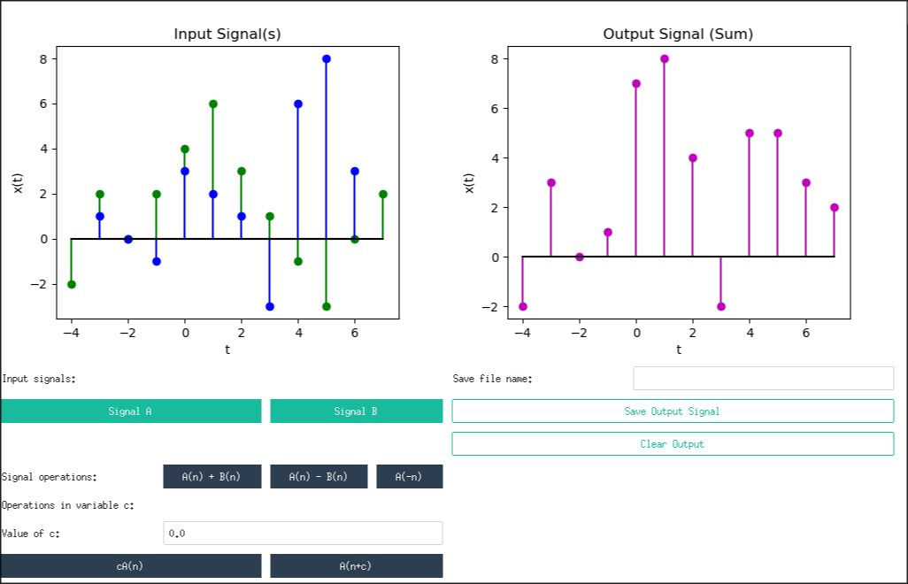

## Task 2

- Sinusoidal signal generation
- Sampling generated signal
  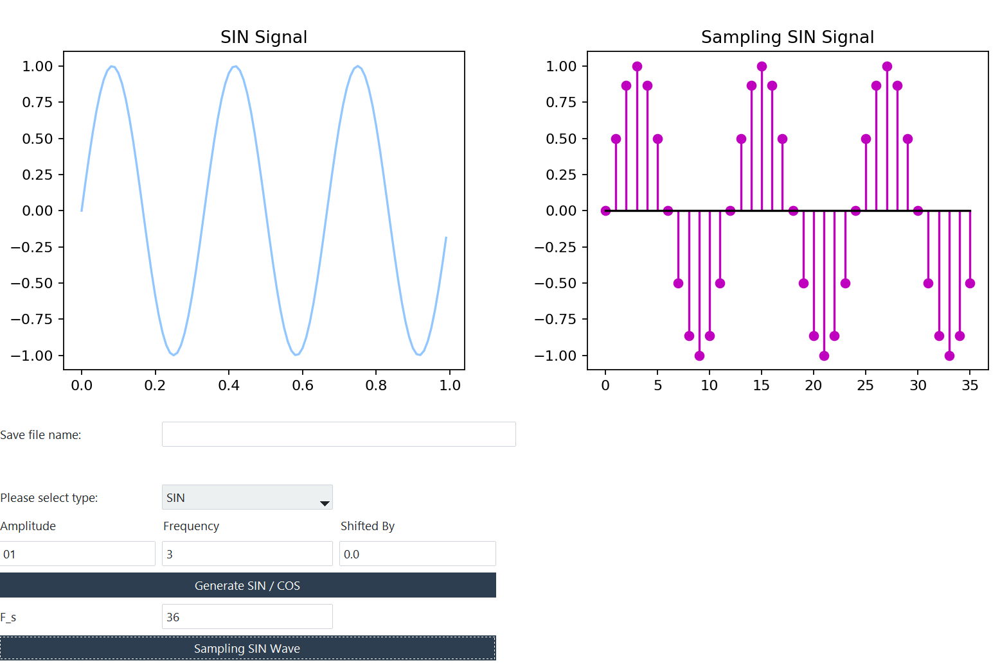

## Task 3

- Signal quantization
  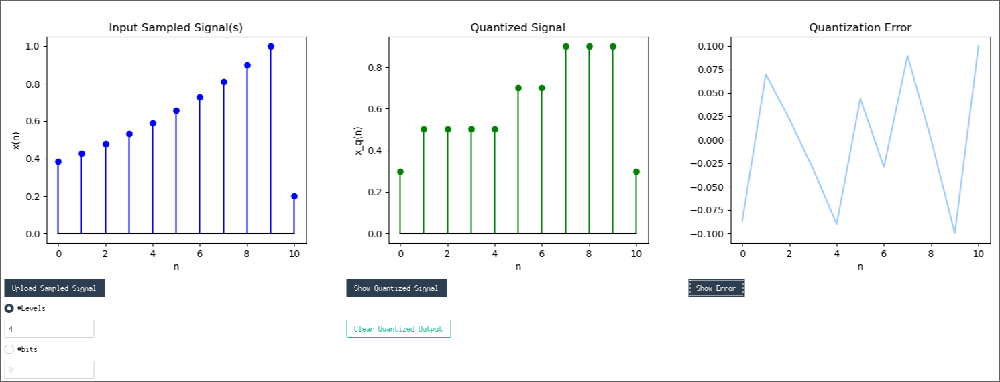

## Task 4

- Derivative
  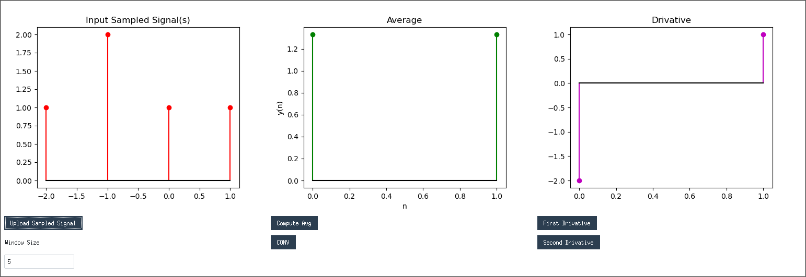
- Convolution
  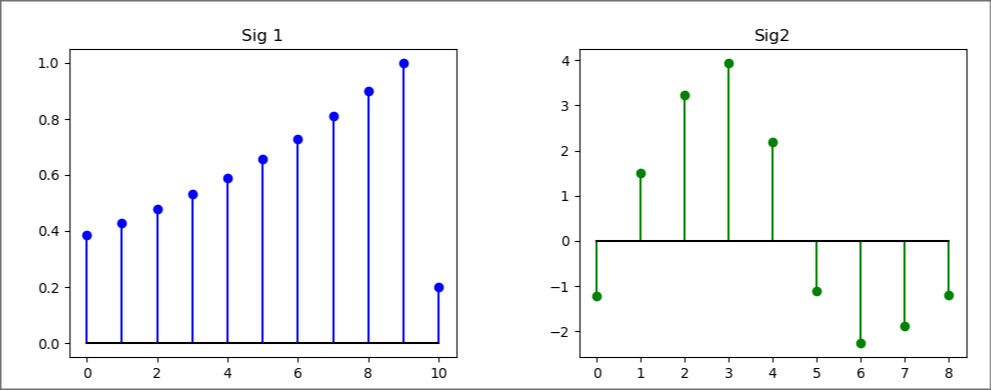

  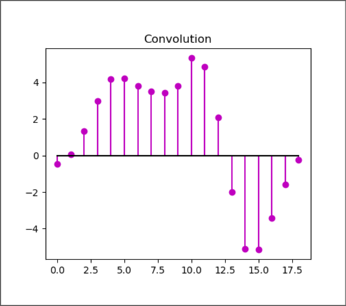

## Task 5

- Discrete Fourrier Transform
  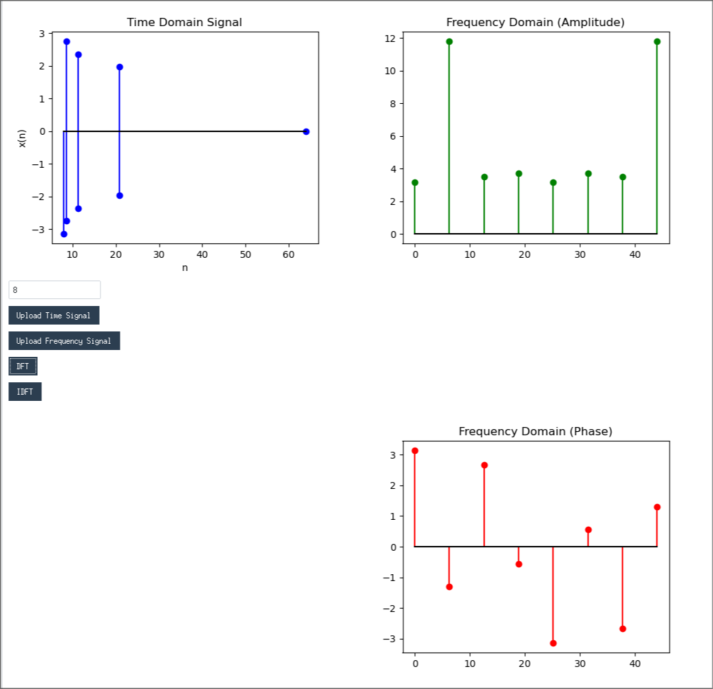
- Inverse Discrete Fourrier Transform
  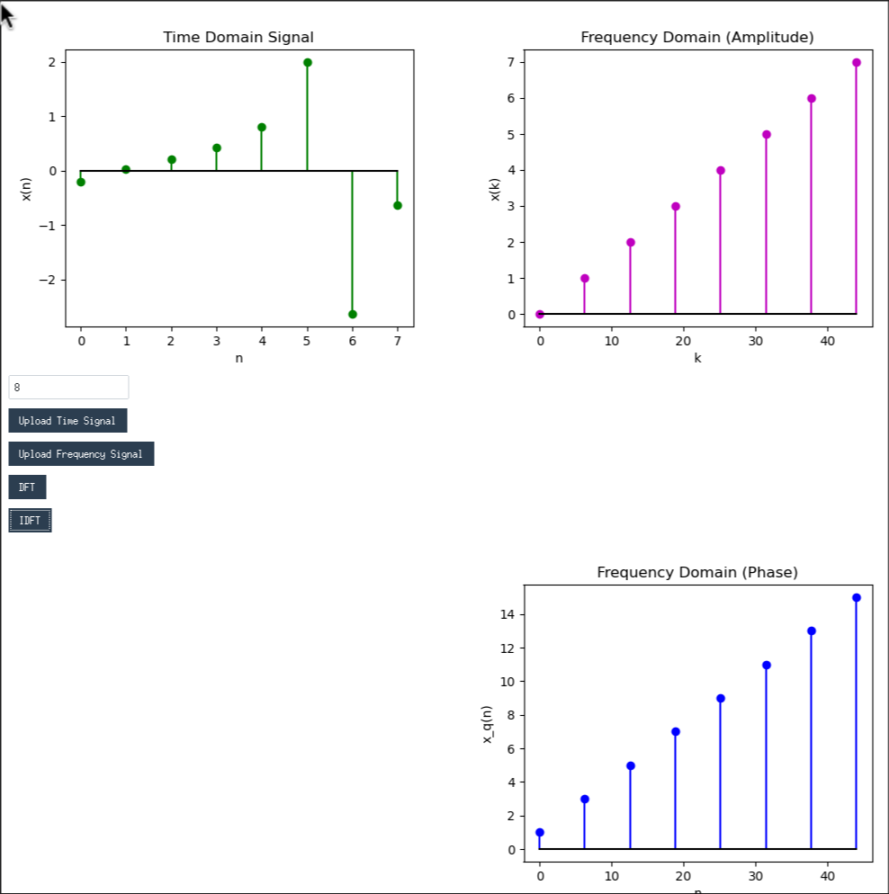

## Task 6

- Correlation
- Calculating delay using autocorrelation
- Signal classification
  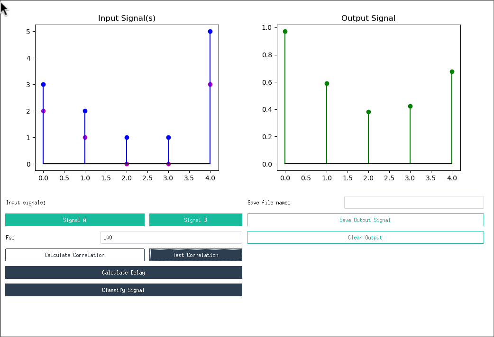

## Task 7

- Filters
  - Low pass
  - High pass
  - Band pass
  - Band reject
    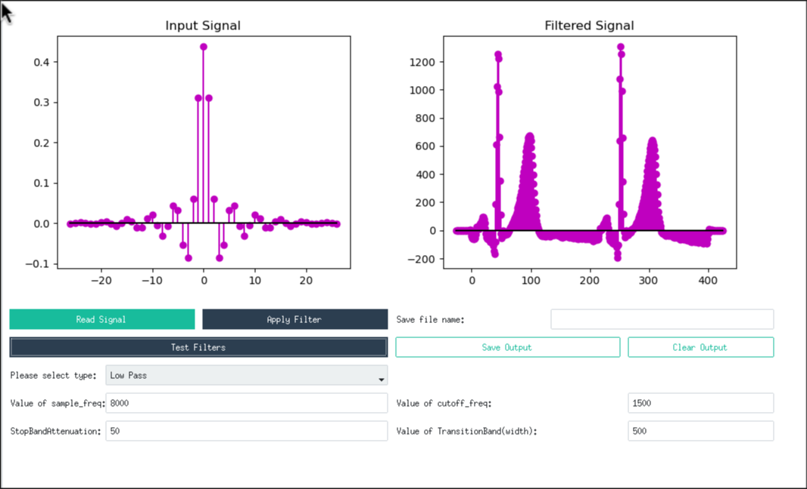
    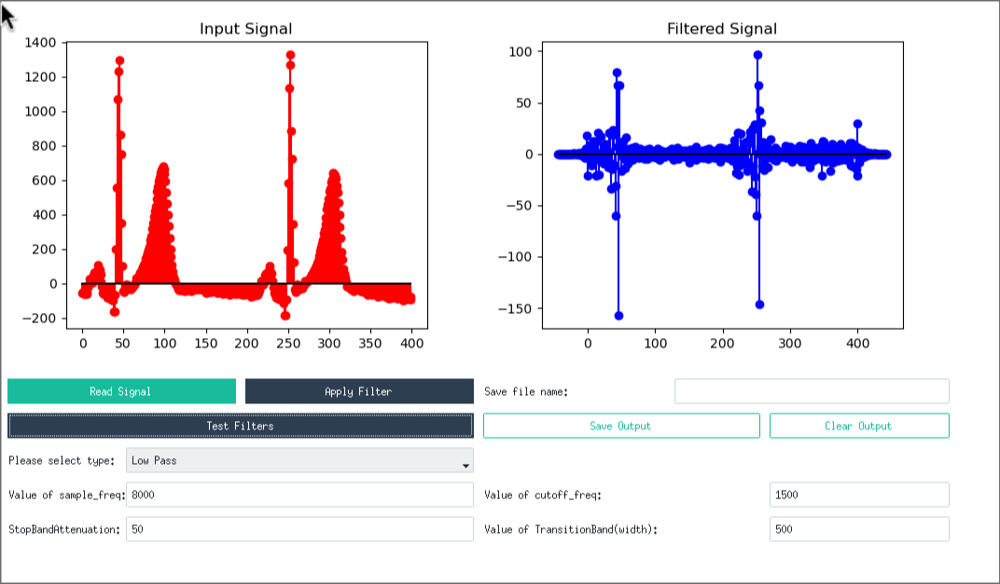
